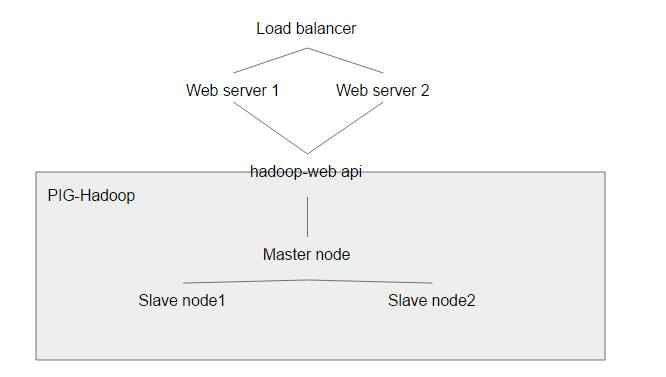

# Web Application Development Source Code Submission for Group 3
## Current State of the Project.
The Website Server   : 2 NodeJS Server
Load Balancer : nginx (Least Connection Algorithms)
Hadoop Cluster : 1  Master Node  , 2  Slave Node

All of the project server can be run. But we can't connect the
pig job to the website server.

## Known Bug & Issues

Pig

User input : Each sentence must not have new line. For example,

I am kong.

Be sure to check the copyright laws for your country before downloading or redistributing this or any other Project Gutenberg eBook.

## Report

### System Architecture
Our group design consist of 6 server. which is
load balancer , 1 Hadoop master node, 2 Hadoop slave node and 2 web server.

 The Load Balancer will balance the load from the Hadoop Cluster and Web Server. In our design the input will be received from the Frontend and will be relay to the Hadoop cluster to be process by pig. So we install the NodeJS server inside the master node for easy connection between webserver and the hadoop cluster.
 
 
### Group Member
- Supason Kotanut 5610546800 Github : [XMistralX](https://github.com/XMistralX/)
Contribution : Frontend
- Niti Petcharatmora 5610545013 Github : [NitiK](https://github.com/NitiK) Contribution : Pig
- Muninthorn Thongnuch 5610545765 Github : [yoyothai00](https://github.com/yoyothai00) Contribution : Server Configuration
- Thanaphon Ketsin 5610546729 Github : [RookieMo](https://github.com/RookieMo) Contribution : Server Configuration
- Wuttipong Khemphetjetsada 5610545803 Github : [kazixma](https://github.com/kazixma) Contribution : Frontend
